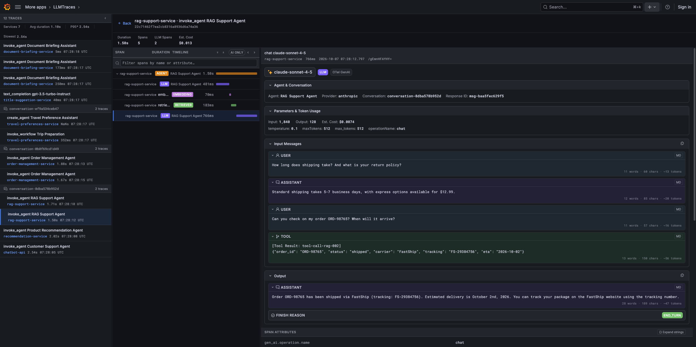

# LLM Traces — Grafana Plugin

[](https://github.com/enki-farm/llm-traces/actions/workflows/ci.yml)
[](https://github.com/enki-farm/llm-traces/blob/main/LICENSE)

A Grafana app plugin for visualizing LLM (Large Language Model) traces stored in [Grafana Tempo](https://grafana.com/oss/tempo/).

Supports OpenTelemetry GenAI semantic conventions out of the box.

> **Development note:** Significant parts of this project have been edited and
> extended with the help of AI tools. The developer has actively directed the
> work, made the design and implementation decisions, and remains responsible
> for reviewing and maintaining the project.

## Features

- Browse and search LLM traces via TraceQL
- Inspect input/output messages with Markdown rendering
- View tool calls with JSON payloads
- OTel GenAI span detection and detail panels
- Token usage and estimated cost per span
- Trace timeline with span hierarchy visualization
- Resizable detail panels



## Requirements

| Component | Version |
|-----------|---------|
| Grafana | &ge; 13.0.0 |
| Node.js | &ge; 22.6 (for development) |
| A configured [Tempo](https://grafana.com/docs/tempo/latest/) datasource | |

## Installation

### From GitHub Releases (recommended)

1. Download the latest release zip from the [Releases](https://github.com/enki-farm/llm-traces/releases) page
2. Extract it into your Grafana plugins directory:
   ```bash
   unzip llm-traces-app-*.zip -d /var/lib/grafana/plugins/
   ```
3. Add the plugin to Grafana's allow list (required for unsigned community plugins):
   ```ini
   [plugins]
   allow_loading_unsigned_plugins = llm-traces-app
   ```
4. Restart Grafana

### Using Docker Compose

A ready-to-run stack with Grafana + Tempo is included for local development:

```bash
# Build the plugin first
npm install && npm run build:standalone

# Start the stack (run from repo root)
docker compose -f docker/docker-compose.yml up --build
```

Open **http://localhost:3000** (admin / admin). Tempo OTLP endpoints are available at `localhost:4317` (gRPC) and `localhost:4318` (HTTP).

> Requires Docker Compose v2.17+ for `dockerfile_inline` support.

### Synthetic GenAI traces

With the local Tempo stack running, inject demonstration spans using:

```bash
python3 -m pip install -r requirements.txt
python3 scripts/inject_otel_ai_traces.py
```

The injector sends OTLP/HTTP to `localhost:4318/v1/traces`; it does not call any AI provider. Its six scenario groups cover agent planning and tools, Gemini recommendations, RAG with standalone embeddings, order management, a memory-store/workflow lifecycle, and streamed and background responses. Together they emit all 18 well-known operations in the checked-in [GenAI span conventions](https://github.com/enki-farm/llm-traces/blob/main/docs/otel_genai_semantic_convention_spans.md), plus representative prompt, cache, multimodal, streaming, polling and error attributes. Message and memory content is synthetic opt-in demonstration data, not a production capture policy.

The span coverage and consistency checks run without Tempo:

```bash
python3 -m unittest discover -s tests -p 'test_inject_otel_ai_traces.py'
```

### Using provisioning

To auto-enable the plugin (Grafana app plugins must be explicitly enabled):

```yaml
# /etc/grafana/provisioning/plugins/llm-traces.yaml
apiVersion: 1
apps:
  - type: llm-traces-app
    org_id: 1
    disabled: false
```

## Usage

1. Navigate to **LLM Traces** in the Grafana side menu
2. Select a Tempo datasource
3. Use the search bar or [TraceQL](https://grafana.com/docs/tempo/latest/traceql/) to find traces
4. Click a trace to see the full span hierarchy
5. Click an LLM span to inspect messages, parameters, and token usage

## Development

```bash
# Install dependencies (also sets up pre-commit hook via Husky)
npm install

# Build (standalone — no Grafana monorepo needed)
npm run build:standalone

# Run all unit tests
npm test

# Run individual test files
node --experimental-strip-types tests/llmUtils.unit.test.ts
node --import ./tests/node-loader.mjs --experimental-strip-types tests/tempoClient.unit.test.ts
node --experimental-strip-types tests/costUtils.unit.test.ts
node --experimental-strip-types tests/prism-traceql.unit.test.ts

# Lint & typecheck
npm run typecheck
npm run lint

# Validate plugin
npx -y @grafana/plugin-validator@latest -sourceCodeUri https://github.com/enki-farm/llm-traces https://github.com/enki-farm/llm-traces/releases/download
/<version>/llm-traces-app-<version>.zip
```

> **Note:** Node.js >= 22.6 is required for the `--experimental-strip-types` flag used by the test runner and build scripts.

### End-to-end tests

The devcontainer includes Chromium and its Debian runtime dependencies. After adding or changing the devcontainer configuration, rebuild the container in VS Code. The browser version matches `@playwright/test` in `package.json`; do not run `playwright install --with-deps` inside the Debian container (Playwright selects unavailable Ubuntu font packages there).

In the devcontainer, install dependencies and build the plugin:

```bash
npm ci
npm run build:standalone
```

On the Docker host, from the same repository directory, start Grafana with that build (the devcontainer does not install the Docker CLI):

```bash
docker compose -f docker/docker-compose.yml up --build -d
```

Back in the devcontainer, verify Grafana is reachable and run the tests:

```bash
curl -f http://localhost:3000/api/health
npm run e2e
```

The Compose build copies `dist/` into the Grafana image, so rebuild the plugin and rerun Compose with `--build` after source changes. If Grafana is already running with the current build, just run `npm run e2e`. The tests use `http://localhost:3000` by default; set `GRAFANA_URL` to point at another instance. To run one spec, use `npx playwright test tests/llm-trace-explorer.spec.ts`. View failures in `playwright-report/`, and stop the local stack on the host with `docker compose -f docker/docker-compose.yml down`.

See [CONTRIBUTING.md](https://github.com/enki-farm/llm-traces/blob/main/CONTRIBUTING.md) for detailed contribution guidelines.

## Origin and License

This project is an enki-maintained fork and substantially modified
continuation of Agoda's LLM Traces.

The original project was created by Agoda Services Co., Ltd. and
released under the Apache License 2.0. This project retains and
extends parts of the original project's architecture, UI, build
tooling, and implementation while substantially updating the
implementation around current Grafana and OpenTelemetry GenAI
semantic conventions.

We are grateful to the original authors and contributors for the
foundation this project builds upon.

Copyright 2026 enki GmbH.

Enki provides this software as free and open-source software. Optional
commercial support and services are offered separately and do not restrict
the rights granted by the Apache License, Version 2.0.

This project is licensed under the Apache License, Version 2.0.
See [LICENSE](https://github.com/enki-farm/llm-traces/blob/main/LICENSE) and [NOTICE](https://github.com/enki-farm/llm-traces/blob/main/NOTICE) for details.